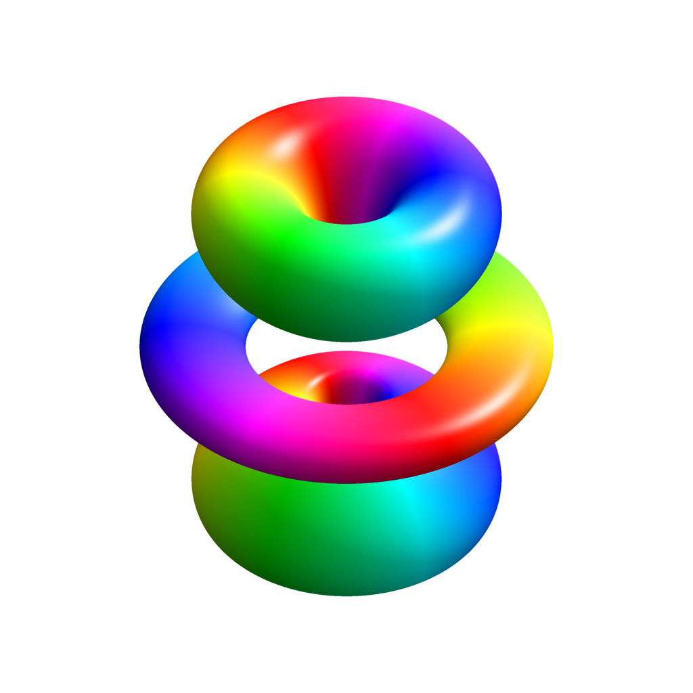

# AtomicOrbitals

    

    <h3 align="center">Atomic orbitals</h3>

    

        An Hartree-Fock approach to find atomic ground state and electronic density using Slater type orbitals (STO) and Gaussian type orbitals (GTO).
    

